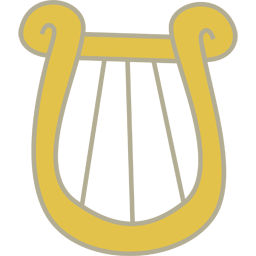

# CutieFont

by [Pixel Coder](https://www.deviantart.com/beckiergb) with artwork by BlackGryph0n, SilverVectors, ParclyTaxel, TheSmilingPony, ArcticKiwi, ZuTheSkunk, SirCxyrtyx, KatiePox, dipi11, uxyd, and Durpy.

CutieFont is a TrueType font with embedded color images, like emoji fonts, except instead of emoji it contains Cutie Marks! The version named **CutieFont.ttf.sbix.ttf** works only with Mac OS X 10.8 Mountain Lion or later. The version named **CutieFont.ttf.svg.ttf** will work with Mozilla Firefox and will soon work with Adobe CC and Windows 10.

The font was generated by FontForge, but since FontForge does not support embedded color images, they had to be injected into the generated font using [Kreative BitsNPicas](https://github.com/kreativekorp/bitsnpicas).

CutieFont contains artwork by BlackGryph0n, SilverVectors, ParclyTaxel, TheSmilingPony, ArcticKiwi, ZuTheSkunk, SirCxyrtyx, KatiePox, dipi11, uxyd, and Durpy, and is released under Creative Commons Attribution Non-Commercial Share-Alike.

The list of Cutie Marks included in the font and how to type them follows.

| Keyboard Mapping | Unicode Code Point | Cutie Mark
| ---------------- | ------------------ | -----------------------------------
|        t         |        F61A        |  Twilight Sparkle
|        p         |        F61B        |  Pinkie Pie
|        d         |        F61C        |  Rainbow Dash
|        a         |        F61D        |  Applejack
|        r         |        F61E        |  Rarity
|        f         |        F61F        |  Fluttershy
|        c         |        F620        |  Princess Celestia
|        l         |        F621        |  Princess Luna
|        k         |        F622        |  Princess Cadence
|        y         |        F623        |  Lyra Heartstrings
|        b         |        F624        |  Bon Bon
|        h         |        F625        |  Derpy Hooves
|        w         |        F626        |  Doctor Hooves / Colgate
|        v         |        F627        |  Vinyl Scratch
|        o         |        F628        |  Octavia
|        q         |        F629        |  Carrot Top
|        u         |        F62A        |  Berry Punch
|        m         |        F62B        |  Big Macintosh
|        g         |        F62C        |  Granny Smith
|        e         |        F62D        |  Cheerilee
|        x         |        F62E        |  Trixie
|        z         |        F62F        |  Zecora
|        s         |        F630        |  Shining Armor
|        n         |        F631        |  Twinkleshine
|        R         |        F632        |  Roseluck
|        L         |        F633        |  Lily
|        D         |        F634        |  Daisy
|        I         |        F635        |  Snips
|        J         |        F636        |  Snails
|        T         |        F637        |  Diamond Tiara
|        S         |        F638        |  Silver Spoon
|        W         |        F639        |  Twist
|        M         |        F63A        |  Mayor Mare
|        N         |        F63B        |  Nurse Redheart
|        A         |        F63C        |  Aloe
|        O         |        F63D        |  Lotus
|        F         |        F63E        |  Flitter
|        G         |        F63F        |  Cloudchaser
|        i         |        F640        |  Wonderbolt
|        j         |        F641        |  Wonderbolt Insignia
|        \[        |        F642        |  Mrs. Cup Cake
|        \]        |        F643        |  Mr. Carrot Cake
|        Y         |        F644        |  Amethyst Star
|        C         |        F645        |  Cherry Berry
|        K         |        F646        |  Cloud Kicker
|        3         |        F647        |  Lemon Hearts
|        X         |        F648        |  Raindrops
|        E         |        F649        |  Seaform Swirl
|        B         |        F64A        |  Braeburn
|        @         |        F64B        |  Caramel
|        P         |        F64C        |  Apple Fritter
|        Q         |        F64D        |  Apple Bumpkin
|        U         |        F64E        |  Uncle Orange
|        V         |        F64F        |  Aunt Orange
|        \`        |        F650        |  Lily Blossom
|        H         |        F651        |  Hoity Toity
|        #         |        F652        |  Dumbbell
|        %         |        F653        |  Hoops
|        $         |        F654        |  Quarterback
|        *         |        F655        |  Sheriff Silverstar
|        0         |        F656        |  Prince Blueblood
|        8         |        F657        |  Daring Do
|        (         |        F658        |  Flim
|        )         |        F659        |  Flam
|        4         |        F65A        |  Fancypants
|        5         |        F65B        |  Fleur De Lis
|        <         |        F65C        |  Jet Set
|        >         |        F65D        |  Upper Crust
|        9         |        F65E        |  Cherry Jubilee
|        Z         |        F65F        |  Sunset Shimmer
|        _         |        F660        |  Allie Way
|        6         |        F661        |  Blues
|        &         |        F662        |  Caesar
|        :         |        F663        |  Dizzy Twister
|        =         |        F664        |  Frederick Horseshoepin
|        ,         |        F665        |  Lightning Bolt
|        -         |        F666        |  Linky
|        7         |        F667        |  Lucky Clover
|        .         |        F668        |  Medley
|        /         |        F669        |  Mjolna
|        +         |        F66A        |  Parasol
|        ^         |        F66B        |  Pokey Pierce
|        ?         |        F66C        |  Screwball
|        !         |        F66D        |  Snowflake
|        ;         |        F66E        |  Tornado Bolt
|        1         |        F670        |  Archer
|        2         |        F671        |  Tootsie Flute
|        \\        |        F672        |  Truffle Shuffle
|        {         |        F680        |  Night Light
|        }         |        F681        |  Twilight Velvet
|        '         |        F682        |  Clyde Pie
|        "         |        F683        |  Sue Pie
|        \|        |        F6FE        |  Firefly
|        ~         |        F6FF        |  Fausticorn
